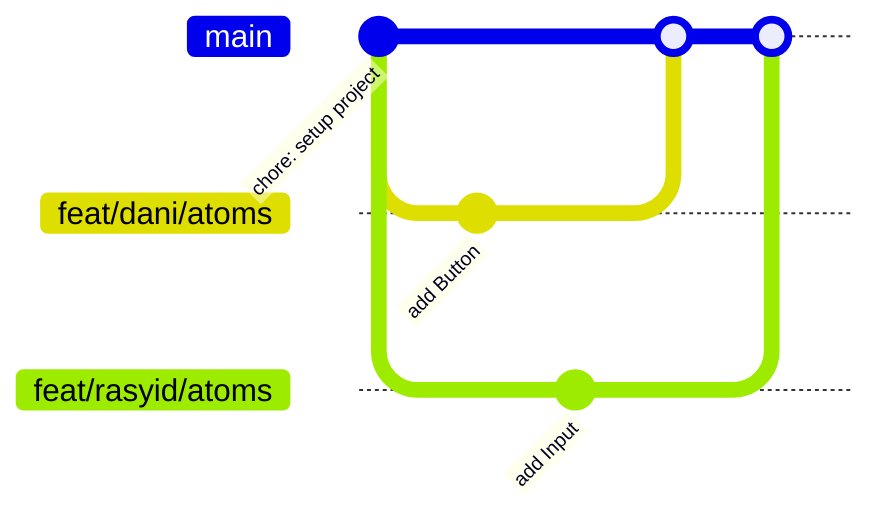

# Workflow Git Kolaborasi — Proyek Intelliweb

> Panduan kerja tim frontend (2 developer) dengan branch per nama,
> kerja paralel, dan pengembangan bertahap Atomic Design.

---

## 1. Konsep Dasar Workflow

- **Branch per nama**: setiap orang punya branch sendiri (`feat/dani/...` dan `feat/rasyid/...`)
- **Kerja paralel**: berdua kerja di waktu yang sama, tapi di file yang berbeda
- **Merge ke main**: setiap sore setelah selesai per-bagian
- **Pengembangan bertahap Atomic Design**:
  `assets → atoms → molecules → organisms → templates → pages` DIKERJAKAN BER-URUTAN!

### Visual Alur Merge



---

## 2. Perintah Dasar yang Wajib Hafal

| Perintah | Fungsi |
|----------|--------|
| `git status` | Melihat file yang berubah / belum di-commit |
| `git add .` | Menandai semua perubahan untuk di-commit (staging) |
| `git commit -m "pesan"` | Menyimpan perubahan dengan pesan |
| `git push origin main` | Mengunggah commit ke remote (GitHub) |
| `git pull origin main` | Menarik perubahan terbaru dari remote |
| `git merge <nama-branch>` | Menggabungkan branch lain ke branch aktif |
| `git branch` | Melihat daftar branch |
| `git checkout -b <nama>` | Membuat sekaligus pindah ke branch baru |

---

## 3. Fase 0: Setup Awal (Sekali Saja)

### Developer A — buat repo dan push pertama

```bash
# di dalam folder proyek
git init
git add .
git commit -m "chore: initial project setup (Next.js + Tailwind v3 + daisyUI v4)"
git branch -M main
git remote add origin https://github.com/<username>/intelliweb.git
git push -u origin main
```

### Developer B — clone repo

```bash
git clone https://github.com/<username>/intelliweb.git
cd intelliweb
npm install
```

---

## 4. Ritme Harian (Inti dari Workflow Ini)

Ini pola yang diulang **setiap hari** oleh masing-masing developer.

```bash
# ============ PAGI (masing-masing lakukan) ============
git checkout main                # pindah ke branch main
git pull origin main             # tarik update terbaru dari teman
git checkout -b feat/asep/atoms  # buat branch baru (ganti nama sendiri)

# ============ SIANG: kerja + commit rutin ============
# ... mengerjakan komponen ...
git add .
git commit -m "feat(atoms): add button component"
# ... lanjut kerja, commit lagi ...
git add .
git commit -m "feat(atoms): add badge component"

# ============ SORE: merge ke main ============
git checkout main                # pindah ke main
git pull origin main             # PENTING: cek update dari teman dulu
git merge feat/asep/atoms        # gabungkan branch sendiri ke main
git push origin main             # upload ke GitHub
```

> **Aturan emas**: SELALU `git pull origin main` sebelum merge, supaya
> pekerjaan teman yang sudah masuk ke main tidak tertimpa.
> JANGAN ASAL GANTI ISI FILE TEMAN, kasih watermark di setiap isi filebbiar ga KETUKER. 
> CTH: src/app/layout.tsx

```bash
/// creator: rasyid 
export default function RootLayout({ children }: { children: React.ReactNode }) {
  return (
    <html lang="en" className={`${merriweather.variable} ${plusJakartaSans.variable}`}>
      <body className="bg-neutral-base text-neutral-text font-sans antialiased flex flex-col min-h-screen">
        <Navbar />
        <main className="flex-grow">
          {children}
        </main>
        <Footer />
      </body>
    </html>
  );
}
```

---

## 5. Fase per Fase dengan Pembagian Tugas

Setiap fase punya ritme yang sama: bagi tugas → kerja paralel → merge.

### Fase 1: Pengumpulan Asset

**Pembagian**: A = icons (SVG), B = images (WebP)

```bash
# Developer A (icons)
git checkout -b feat/dani/assets
mkdir -p public/icons
# ... masukkan file SVG ...
git add .
git commit -m "feat(assets): add icon SVGs to public directory"
git checkout main && git pull origin main
git merge feat/dani/assets
git push origin main

# Developer B (images)
git checkout -b feat/rasyid/assets
mkdir -p public/images
# ... masukkan file WebP ...
git add .
git commit -m "feat(assets): add hero images to public directory"
git checkout main && git pull origin main
git merge feat/rasyid/assets
git push origin main
```

### Fase 2: Atoms (komponen terkecil)

| Developer A | Developer B |
|-------------|-------------|
| `Button.tsx`, `Badge.tsx`, `Icon.tsx`, `Avatar.tsx` | `Input.tsx`, `Label.tsx`, `Spinner.tsx`, `Card.tsx` |

```bash
# contoh commit Developer A
git add .
git commit -m "feat(atoms): add button component"
git add .
git commit -m "feat(atoms): add badge and icon components"

# sore hari, merge:
git checkout main && git pull origin main
git merge feat/dani/atoms
git push origin main
```

### Fase 3: Molecules (gabungan atoms)

| Developer A | Developer B |
|-------------|-------------|
| `SearchBar.tsx`, `FormGroup.tsx`, `StatCard.tsx` | `StudyProgressBar.tsx`, `AIBadge.tsx`, `UserProfileCard.tsx` |

```bash
git add .
git commit -m "feat(molecules): add search bar component"
# ... dst, lalu merge sore hari
```

### Fase 4: Organisms (bagian halaman yang utuh)

| Developer A | Developer B |
|-------------|-------------|
| `Navbar.tsx`, `HeroSection.tsx`, `Footer.tsx` | `ChatInterface.tsx`, `DashboardSection.tsx`, `RoadmapViewer.tsx` |

### Fase 5: Templates (layout halaman)

| Developer A | Developer B |
|-------------|-------------|
| `LandingLayout.tsx` | `DashboardLayout.tsx` |

### Fase 6: Pages (halaman final)

**HATI-HATI DI SINI** — `page.tsx` cuma satu file per halaman, tidak bisa
dipegang berdua. Pembagian yang aman:

- A: `app/page.tsx` (home) + `app/roadmap/page.tsx`
- B: `app/dashboard/page.tsx` + `app/chat/page.tsx`

Atau kalau terpaksa sama-sama menyentuh `app/page.tsx`, bagi **bagian**
(file berbeda): buat komponen section di file terpisah, `page.tsx` hanya
merangkai. Contoh:

```
app/page.tsx            # hanya merangkai (dipegang 1 orang)
components/landing/
├── HeroSection.tsx     # dipegang A
├── FeatureSection.tsx  # dipegang B
└── CTASection.tsx      # dipegang B
```

---

## 6. Kalau Terjadi Conflict (Tabrakan Kode)


Conflict hanya terjadi kalau **dua orang mengubah baris yang sama
di file yang sama**. Cara mengatasinya:

### Langkah 1: Tarik dulu, lihat apa yang konflik

```bash
git pull origin main
# atau saat merge:
git merge feat/rasyid/atoms
```

Git akan memberi tahu file yang konflik (status: `both modified`).

```bash
git status
```

### Langkah 2: Buka file yang konflik

Git menandai lokasi konflik dengan marker:

```tsx
<<<<<<< HEAD
<main>Struktur buatan saya</main>
=======
<main>Struktur buatan teman</main>
>>>>>>> feat/budi/atoms
```

### Langkah 3: Pilih / gabungkan, hapus marker

```tsx
<main>
  {/* gabungkan bagian terbaik dari keduanya */}
  <HeroSection />
  <FeatureSection />
</main>
```

Hapus semua baris `<<<<<<< HEAD`, `=======`, dan `>>>>>>> ...`.

### Langkah 4: Commit hasil resolve dan push

```bash
git add .
git commit -m "merge: resolve conflict in page.tsx"
git push origin main
```

> **File TIDAK akan hilang atau rusak permanen** — conflict hanya
> menandai area yang harus diputuskan manual. Kalau salah pilih,
> tinggal perbaiki dan commit lagi.

---

## 7. Aturan Emas Tim

1. **Bagi file di awal cycle** — komunikasikan siapa pegang file apa
2. **PULL SEBELUM MULAI, PULL SEBELUM MERGE** — `git pull origin main`
3. **Commit kecil & sering** — pakai pesan yang jelas
4. **Satu orang pegang satu file** pada waktu yang bersamaan
5. **Jangan push langsung** kalau belum pull (push akan ditolak Git, bukan menimpa diam-diam)
6. **Merge di sore hari** — jangan biarkan branch menganggur berhari-hari

---

## 8. Tabel Pesan Conventional Commit

| Jenis | Kapan Dipakai | Contoh |
|-------|---------------|--------|
| `feat` | Menambah fitur/komponen baru | `feat(atoms): add button component` |
| `fix` | Memperbaiki bug | `fix(navbar): correct mobile menu z-index` |
| `style` | Mengubah gaya (tidak mengubah logika) | `style(atoms): adjust button padding` |
| `refactor` | Menata ulang kode tanpa mengubah fungsi | `refactor(organisms): extract nav links to array` |
| `chore` | Tugas teknis (config, dependency) | `chore: update tailwind config` |
| `docs` | Menambah/mengubah dokumentasi | `docs: update README` |
| `merge` | Commit hasil resolve conflict | `merge: resolve conflict in page.tsx` |

Format umum:

```
<jenis>(<scope>): <deskripsi singkat>

Contoh:
feat(assets): add icon SVGs to public directory
feat(atoms): add input component
feat(molecules): add search bar component
feat(organisms): add navbar component
feat(templates): add dashboard layout
```

---

## 9. Checklist Harian

- [ ] Pagi: `git checkout main` → `git pull origin main`
- [ ] Pagi: `git checkout -b feat/<nama>/<fitur>`
- [ ] Siang: kerja + `git add .` + `git commit -m "..."` (berulang)
- [ ] Sore: `git checkout main` → `git pull origin main`
- [ ] Sore: `git merge feat/<nama>/<fitur>` → `git push origin main`
- [ ] Ada conflict? Buka file → pilih kode → hapus marker → commit → push

---

*Selamat ngoding! 🚀 — Tim Frontend Intelliweb*
